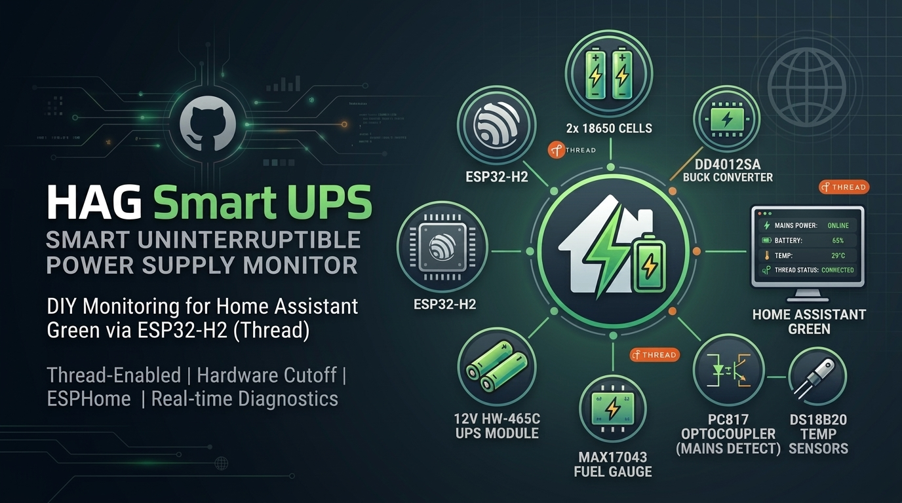
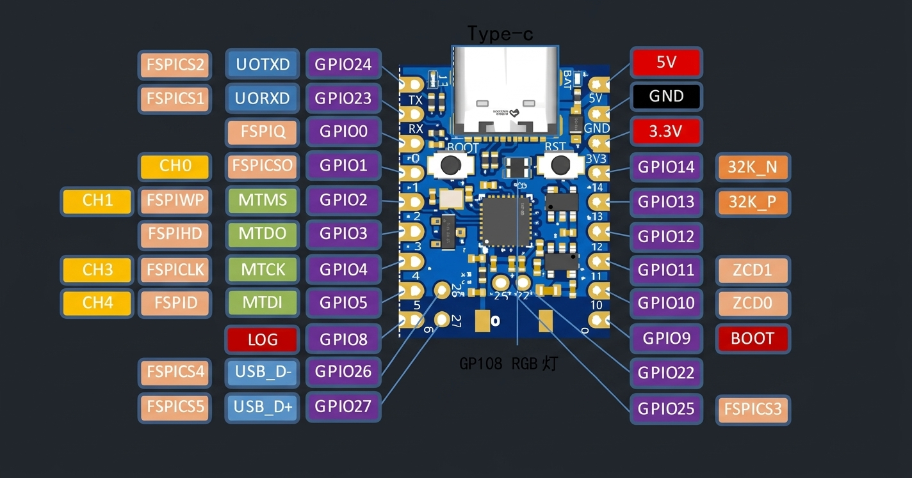

# Home Assistant Green Smart UPS - *Up To 6 Hours Runtime*

> A DIY Uninterruptible Power Supply with smart monitoring capabilities for the Home Assistant Green hub, featuring ESP32-H2 microcontroller and Thread wireless protocol.

---

## Table of Contents
1. [Overview](#overview)
2. [Features](#features)
3. [Bill of Materials](#bill-of-materials)
4. [Power and Connection Diagram](#power-and-connection-diagram)
5. [Step-by-Step Assembly Guide](#step-by-step-assembly-guide)
6. [ESP32-H2 Super Mini Pinout Reference](#esp32-h2-super-mini-pinout-reference)
7. [Software Configuration](#software-configuration)
8. [Thread Network Setup](#thread-network-setup)
9. [Estimated Runtime](#estimated-runtime)
10. [Troubleshooting](#troubleshooting)
11. [Future Modifications](#future-modifications)

---

## Overview

This project provides a complete DIY Uninterruptible Power Supply (UPS) system with smart monitoring capabilities for the Home Assistant Green hub. The system utilizes:

- **ESP32-H2 Microcontroller**: Wireless communication via Thread protocol
- **HW-465C UPS Module**: 12V boost conversion and battery charging management
- **MAX17043 Fuel Gauge**: Real-time battery state of charge monitoring
- **DS18B20 Temperature Sensors**: Battery cell temperature monitoring
- **PC817 Optocoupler**: Mains power detection
- **DD4012SA Buck Converter**: 12V to 5V step-down conversion with built-in protections

The "Hardware Cutoff" configuration ensures the Home Assistant Green automatically reboots when grid power is restored, without requiring software-managed relays.

---

## Features

| Feature | Description |
|---------|-------------|
| **Real-time Monitoring** | Battery level, voltage, cell temperatures, mains status |
| **Thread Protocol** | Wireless communication via OpenThread Border Router |
| **Persistent Logging** | NVS-backed timestamps that survive power loss |
| **Smart Time Sync** | Auto-retry mechanism (up to 4.5 minutes) |
| **Remote Management** | Restart button and adjustable polling interval |
| **Hardware Protection** | Automatic battery cutoff to prevent deep discharge |
| **Protected Power Path** | DD4012SA provides built-in OVP/OCP/SCP/OTP for the ESP32 rail |

---

## Home Assistant Integration

Once flashed and connected to your Thread network, the HAG Smart UPS automatically integrates with Home Assistant, exposing a comprehensive set of entities for monitoring and control.

### Exposed Sensors

| Entity Name | Type | Description | Update Interval |
|-------------|------|-------------|-----------------|
| **UPS Battery Level** | Percentage | Real-time state of charge from MAX17043 fuel gauge | 30 seconds |
| **UPS Battery Voltage** | Voltage (V) | Current battery voltage (3.0V - 4.2V range) | 30 seconds |
| **UPS Battery Cell 1 Temperature** | Temperature (°C) | DS18B20 temperature reading on cell 1 | 10 seconds |
| **UPS Battery Cell 2 Temperature** | Temperature (°C) | DS18B20 temperature reading on cell 2 | 10 seconds |
| **UPS Thread Signal Strength** | RSSI (dBm) | Thread network signal strength to OTBR | 60 seconds |

### Exposed Binary Sensors

| Entity Name | Type | Description |
|-------------|------|-------------|
| **Mains Power Status** | Binary | ON when grid power is present, OFF during outage |

### Exposed Text Sensors (Event Logging)

| Entity Name | Description | Persistence |
|-------------|-------------|-------------|
| **Time Sync** | Current time synchronization status (Pending/Success/Failed) | Survives reboot |
| **Last Power Outage Time** | Timestamp when last mains failure was detected | Survives reboot |
| **Last Mains Restore Time** | Timestamp when mains power was restored | Survives reboot |
| **Last Low Battery 3% Time** | Timestamp when critical 3% battery threshold was reached during outage | Survives reboot |
| **Last Reboot Time** | Timestamp of last ESP32-H2 boot | Resets on reboot |

### Exposed Thread Network Info

| Entity Name | Description |
|-------------|-------------|
| **Thread Device Role** | Current OpenThread device role (Child/Sleepy End Device) |
| **Thread IP Address** | Assigned IPv6 address on the Thread network |
| **Thread Channel** | Thread radio channel in use |

### Exposed Buttons

| Entity Name | Action |
|-------------|--------|
| **Restart UPS Monitor** | Triggers a soft restart of the ESP32-H2 firmware |

### Exposed Controls

| Entity Name | Range | Default | Description |
|-------------|-------|---------|-------------|
| **Sensor Update Interval** | 10s - 120s (5s steps) | 30s | Adjustable polling interval for fuel gauge updates |

---

## What You Get

Building this project gives you a complete, self-contained UPS monitoring solution for your Home Assistant Green hub:

**Core Functionality:**
- **Intelligent Battery Management**: The MAX17043 fuel gauge provides accurate state-of-charge readings, while the dual DS18B20 sensors monitor cell temperatures to prevent thermal runaway
- **Power Outage Detection**: Instant notification when mains power is lost, with automatic timestamp logging of outage start, end, and critical events
- **Automatic Recovery**: The "Hardware Cutoff" design ensures your Home Assistant Green reboots automatically when power is restored—no software intervention needed
- **Extended Runtime**: Up to 6 hours of backup power with dual 18650 cells in 1S2P configuration

**Smart Monitoring Features:**
- Persistent event logging that survives power cycles and reboots
- Smart time synchronization with automatic retry logic
- Configurable update intervals for battery polling
- Thread network diagnostics (signal strength, device role, IP address)

**Integration Benefits:**
- All entities appear automatically in Home Assistant via the native ESPHome API
- Build automations around power events (e.g., notify when outage begins, log battery levels)
- Remote device management with one-click restart capability
- No cloud dependencies—everything runs locally on your network

---

## Bill of Materials

### Core Components

| Component | Quantity | Notes |
|-----------|----------|-------|
| Home Assistant Green | 1 | Main hub (Load) |
| ESP32-H2 Super Mini | 1 | Thread end device |
| SLZB-MR5U (or similar) | 1 | OpenThread Border Router |
| HW-465C UPS Module | 1 | 12V boost + charger |
| 18650 Battery Cells | 2 | 3000mAh+ capacity, 1S2P configuration |
| MAX17043 I2C Fuel Gauge Module | 1 | Battery SoC monitoring |
| PC817 or EL817 Optocoupler | 1 | Mains detection (100% interchangeable) |
| DS18B20 Temperature Sensors | 2 | One per battery cell |
| DD4012SA Buck Converter (5V variant) | 1 | 12V to 5V conversion with built-in protections |

### Electronic Components

| Component | Value | Notes |
|-----------|-------|-------|
| Current-limiting Resistor (Optocoupler LED) | 330Ω | For optocoupler input |
| Pull-up Resistor (1-Wire Bus) | 4.7kΩ | For DS18B20 data line |
| Electrolytic Capacitor (Optional) | 100µF - 220µF | Voltage stabilization on the 5V rail |

### Power Supply Requirements

| Parameter | Specification | Notes |
|-----------|---------------|-------|
| Input Voltage | 220V AC (Mains) | Standard household outlet |
| Output Voltage | 5V DC | USB-C connector |
| Output Current | 3.6A+ / 18W+ | Required for simultaneous charging and operation |
| Connector Type | USB-C | Must use "dumb" charger (no PD/PPS) |

> ⚠️ **IMPORTANT**: Do NOT use fast chargers with PD, PPS, or QuickCharge protocols. The HW-465C lacks smart negotiation chips, and these chargers will default to 5V/1A-2A, causing insufficient power supply.

### Cables and Connectors

| Item | Specification |
|------|---------------|
| DC Output Cable | 12V, male 5.5x2.1mm center-positive |
| Jumper Wires | Various lengths for prototyping |
| Breadboard/Prototype Board | For circuit assembly |

---

## DD4012SA Buck Converter - Detailed Specifications

The DD4012SA is a compact, industrial-grade 5W DC-DC step-down buck converter. The output voltage is **factory-set by SKU** (no potentiometer adjustment required), eliminating the risk of accidental over-voltage that can permanently damage the ESP32-H2.

### DD4012SA Configuration (5V Variant)

| Parameter | Value | Notes |
|-----------|-------|-------|
| Module Variant | DD4012SA_5V | Order specifically the 5V output version |
| Input Voltage | 6.5V – 40V DC | Range comfortably covers the 12V HW-465C rail |
| Output Voltage | 5.0V DC | Factory preset, no user adjustment required |
| Max Output Current | 1A | More than sufficient for the ESP32-H2 (~100 mA peak) |
| Quiescent Current | ~1.5 mA | Very low idle draw, battery-friendly |
| Efficiency | 76% – 90% | Depends on load and input voltage |
| Switching Frequency | 550 kHz | Fixed |
| Pin Pitch | 2.54 mm | Breadboard / Arduino-friendly |
| Form Factor | TO-220 compatible | Can drop-in replace LM78XX linear regulators |
| Dimensions | 18.4 × 10.3 × 6.6 mm | Ultra-compact |
| Operating Temperature | -40 °C to +85 °C | Industrial-grade |
| Power Rating | 5W | — |

### Built-in Protections (Major Advantage over Mini360)

| Protection | Description |
|------------|-------------|
| **Overtemperature Shutdown (OTP)** | Module disables output if junction temperature exceeds safe limit |
| **Short Circuit Protection (SCP)** | Output shuts down on short circuit and auto-recovers when fault clears |
| **Input Under-Voltage Lockout (UVLO)** | Module disables output if input drops below minimum threshold |
| **Overcurrent Protection (OCP)** | Output current limited to safe value to protect module and load |
| **BS-Voltage Protection** | Internal bootstrap protection for the high-side switch |

> ✅ **No Potentiometer to Adjust**: Because the output voltage is factory-set per SKU, there is no risk of accidentally outputting 7V, 9V, or 12V to your ESP32-H2. Just order the **5V** variant (`DD4012SA_5V`) and connect it.

### DD4012SA Pinout

```
       ┌──────────────────┐
       │   DD4012SA 5V    │
       │  (Top View)      │
       │                  │
       │   ┌──────────┐   │
       │   │ IC +     │   │
       │   │ Inductor │   │
       │   └──────────┘   │
       │                  │
       └──┬─────┬─────┬───┘
          │     │     │
         IN+   GND   OUT+
        (VIN)  (GND) (VOUT)
       Pin 1  Pin 2  Pin 3
```

| Pin # | Label | Function | Connect To |
|-------|-------|----------|------------|
| 1 | **IN+** (VIN) | Power input (positive) | HW-465C **OUT+** (12V) |
| 2 | **GND** (IN-) | Power input (negative) / common ground | HW-465C **OUT-** |
| 3 | **OUT+** (VOUT) | 5V regulated output (positive) | ESP32-H2 **5V** pin |

> 📝 **Note**: The DD4012SA's 3-pin TO-220-style footprint is breadboard-friendly, so you can simply plug it into a breadboard or solder header pins for clean wiring. The **input** and **output** share the same **GND** reference (Pin 2).

### DD4012SA Wiring

- DD4012SA **IN+** (Pin 1) → HW-465C **OUT+** (12V)
- DD4012SA **GND** (Pin 2) → HW-465C **OUT-**
- DD4012SA **OUT+** (Pin 3, 5V) → ESP32-H2 **5V** pin (TOP LEFT)
- ESP32-H2 **GND** pin (TOP LEFT) → Common GND bus (DD4012SA GND, HW-465C OUT-)

> ⚠️ **NOTE**: The ESP32-H2 will be powered through the DD4012SA. When the HW-465C cuts off battery power, the ESP32 will also lose power, preventing deep discharge.

### Optional DD4012SA Output Stabilization

If the ESP32-H2 experiences boot loops when power is restored from a fully drained state, add a **100µF to 220µF electrolytic capacitor** across the DD4012SA 5V output (Pin 3) and GND (Pin 2).

---

## Power and Connection Diagram

### System Architecture Overview

```
                          ┌──────────────────┐
                          │    MAINS 220V    │
                          └─────────┬────────┘
                                    │ AC
                                    ▼
                          ┌──────────────────┐
                          │   5V USB-C PSU   │
                          │  (3.6A+ / 18W+)  │
                          └─────────┬────────┘
                                    │ 5V
                                    ▼
                          ┌──────────────────┐
                          │    HW-465C UPS   │
                          │  (12V Boost Core)│
                          │                  │
                          │ B+  B-  OUT+ OUT-│
                          └──┬───┬──────┬────┘
                             │   │      │     │ 5V rail
                             │   │      │     │ (via 330Ω)
                             │   │      │     ▼
                             │   │      │   ┌────────────────┐
                             │   │      │   │   PC817 LED    │
                             │   │      │   │ Pin1 ──► Pin2  │
                             │   │      │   └────────────────┘
                             │   │      │
                             │   │      └──────────► Home Assistant Green (12V Load)
                             │   │
                             │   └──────────────────┐
                             │                      │
                             ▼                      ▼
                      ┌─────────────┐         ┌─────────────┐
                      │   18650     │         │  DD4012SA   │
                      │   Pack      │         │  Buck Conv. │
                      │  (1S2P)     │         │  12V → 5V   │
                      │ ~6000 mAh   │         └──────┬──────┘
                      └──────┬──────┘                │ 5V
                             │                       ▼
                             │                ┌──────────────┐
                             │                │   ESP32-H2   │
                             │                │ Super Mini   │
                             │                └──┬────────┬──┘
                             │                   │        │
                             │                   │        │ Thread
                             │                   ▼        ▼
                             │            ┌──────────┐ ┌──────────┐
                             │            │ MAX17043 │ │SLZB-MR5U │
                             │            │  Fuel    │ │  (OTBR)  │
                             │            │  Gauge   │ └─────┬────┘
                             │            └────┬─────┘       │
                             │                 │             ▼
                             │                 │      ┌──────────────┐
                             │                 │      │ Home Asst    │
                             │                 │      │ Green (Load) │
                             │                 │      └──────────────┘
                             │                 │
                             ▼                 ▼
                        ┌────────────────────────┐
                        │     DS18B20 (x2)       │
                        │   Temperature Sensors  │
                        └────────────────────────┘
```


### Detailed Wiring Schematic

```
                               MAINS 220V
                                    │ AC
                                    ▼
                        ┌───────────────────────┐
                        │     5V USB-C PSU      │
                        │    (3.6A+ / 18W+)     │
                        └───────────┬───────────┘
                                    │ 5V (Red +, Black -)
                                    ▼
                        ┌───────────────────────┐
                        │       HW-465C UPS     │
                        │                       │
                        │  IN+  IN-  B+  B-     │
                        │  OUT+ OUT-            │
                        └──┬──┬──┬──┬──┬──┬─────┘
                           │  │  │  │  │  │
                           │  │  │  │  │  │
   ┌───────────────────────┘  │  │  │  │  └──────────────► Home Assistant Green
   │  (5V input rail for      │  │  │  │                   (12V Load)
   │   PC817 LED)             │  │  │  │
   │                          │  │  │  │
   ▼                          │  │  │  │
   ┌──────────┐               │  │  │  │
   │  330Ω    │               │  │  │  │
   │ Resistor │               │  │  │  │
   └────┬─────┘               │  │  │  │
        │                     │  │  │  │
        ▼                     │  │  │  │
   ┌────────────────┐         │  │  │  │
   │   PC817        │         │  │  │  │
   │  ┌────┐ ┌────┐ │         │  │  │  │
   │  │Pin1│ │Pin2│ │         │  │  │  │
   │  │(+) │ │(-) │ │         │  │  │  │
   │  └─┬──┘ └─┬──┘ │         │  │  │  │
   │    │      │    │         │  │  │  │
   │    │      └──────────────┘  │  │  │  (HW-465C GND)
   │    │                        │  │  │
   │    │                        │  │  │
   │    │  ┌────┐  ┌────┐        │  │  │
   │    │  │Pin4│  │Pin3│        │  │  │
   │    │  │(C) │  │(E) │        │  │  │
   │    │  └─┬──┘  └─┬──┘        │  │  │
   └────┼────┼───────┼───────────┘  │  │  │
        │    │       │              │  │  │
        │    │       └──────────────┘  │  │  (GND bus)
        │    │                         │  │
        │    │                         │  │
        ▼    │                         │  │
   ESP32-H2  │                         │  │
   GPIO 4    │                         │  │
   (Mains)   │                         │  │
             │                         │  │
             │                         │  └──────► DD4012SA GND (Pin 2)
             │                         │
             │                         └─────────► DD4012SA IN+ (Pin 1)  [12V]
             │
             │  (Battery path)
             │
             ▼
       ┌───────────┐
       │  18650    │
       │   Pack    │
       │  (1S2P)   │
       │ ~6000 mAh │
       │ B+     B- │
       └──┬────┬───┘
          │    │
          │    └──────────────────────────► GND bus (common)
          │
          └─── CELL+ sense ───────────────► MAX17043 CELL+ (battery sense)
```

#### ESP32-H2 Wiring Detail

```
                       ┌───────────────────┐
                       │   DD4012SA        │
                       │  ┌───┐┌───┐┌────┐ │
                       │  │IN+││GND││OUT+│ │
                       │  │   ││   ││    │ │
                       │  └─┬─┘└─┬─┘└─┬──┘ │
                       └────┼────┼────┼────┘
                            │    │    │
                           12V  GND  5V
                            │    │    │
                            │    │    └──────► ESP32-H2 5V  (TOP LEFT)
                            │    │
                            │    └───────────► ESP32-H2 GND (TOP LEFT, common GND bus)
                            │
                            └───── (from HW-465C OUT+)

                       ┌─────────────────────────┐
                       │      ESP32-H2           │
                       │      Super Mini         │
                       │                         │
                       │  ┌────┐         ┌────┐  │
                       │  │ 5V │         │GND │  │
                       │  └────┘         └────┘  │
                       │  ┌────┐         ┌────┐  │
                       │  │3V3 │         │GPIO│  │
                       │  └────┘         │ 10 │◄─┼── MAX17043 SDA
                       │  ┌────┐         └────┘  │
                       │  │GPIO│         ┌────┐  │
                       │  │ 11 │◄────────│GPIO│  │
                       │  └────┘  MAX    │ 5  │◄─┼── DS18B20 Data
                       │          SCL    └─┬──┘  │
                       │                   │     │
                       │  ┌────┐           │ ┌───┴───────────┐
                       │  │GPIO│           └►│ 4.7kΩ Pull-up │
                       │  │ 4  │◄─── PC817   │   (to 3V3)    │
                       │  └────┘    Pin 4    └───────────────┘
                       └─────────────────────────┘
```

#### Sensor Wiring Detail

```
                            ┌──────────────────┐
                            │   18650 Pack     │
                            │  ┌───┐    ┌───┐  │
                            │  │C1 │    │C2 │  │
                            │  │+ -│    │+ -│  │
                            │  └─┬─┘    └─┬─┘  │
                            │    │        │    │
                            │    └───┬────┘    │
                            │        │         │
                            │   B+   │   B-    │
                            └────┬───┴────┬────┘
                                 │        │
                                 ▼        ▼
                            (to HW-465C B+ and B-)

   ┌─────────────────────┐                ┌─────────────────────┐
   │     MAX17043        │                │     DS18B20 x2      │
   │    Fuel Gauge       │                │   Temp Sensors      │
   │                     │                │                     │
   │  ┌────┐  ┌────┐     │                │  ┌────┐    ┌────┐   │
   │  │ VCC│  │ GND│     │                │  │ VCC│    │ VCC│   │
   │  └─┬──┘  └─┬──┘     │                │  └─┬──┘    └─┬──┘   │
   │    │       │        │                │    │         │      │
   │    │       │        │                │   3V3       3V3     │
   │  ┌────┐  ┌────┐     │                │    │         │      │
   │  │ SDA│  │ SCL│     │                │    ├─────────┤      │
   │  └─┬──┘  └─┬──┘     │                │    │         │      │
   │    │       │        │                │  ┌────┐   ┌────┐    │
   │  ┌──────┐  │        │                │  │ DQ │   │ DQ │    │
   │  │CELL+ │  │        │                │  └─┬──┘   └─┬──┘    │
   │  └──┬───┘  │        │                │    │         │      │
   │     │      │        │                │    ├─────────┤      │
   │     │      │        │                │    │         │      │
   └─────┼──────┼────────┘                │   GND       GND     │
         │      │                         │    │         │      │
         │      │                         │    └────┬────┘      │
         │      │                         │         │           │
         │      │                         │   ┌─────┴─────┐     │
         │      │                         │   │  4.7kΩ    │     │
         │      │                         │   │  Pull-up  │     │
         │      │                         │   │  (to 3V3) │     │
         │      │                         │   └─────┬─────┘     │
         │      │                         └─────────┼───────────┘
         │      │                                   │
         │      │                                   ▼
         │      │                           ESP32-H2 GPIO 5
         │      │                           (1-Wire Data)
         │      │
         ▼      ▼
   ESP32 3V3   ESP32 GND
   (3V3 rail)  (GND bus)

         │
         ▼
   Battery B+  (direct, NOT 12V rail)


   ┌─────────────────────────┐
   │   MAX17043 Connections  │
   │                         │
   │  VCC   ──► ESP32 3V3    │
   │  GND   ──► ESP32 GND    │
   │  SDA   ──► ESP32 GPIO 10│
   │  SCL   ──► ESP32 GPIO 11│
   │  CELL+ ──► Battery B+   │
   │            (direct!)    │
   └─────────────────────────┘
```


#### Mains Detection Wiring (PC817 Optocoupler)

```
   HW-465C 5V rail
        │
        ▼
   ┌─────────┐
   │  330Ω   │
   │ Resistor│
   └────┬────┘
        │
        ▼
   ┌────────────────────────────────┐
   │            PC817               │
   │                                │
   │  INPUT (LED side)              │
   │  ┌──────────┐   ┌──────────┐   │
   │  │  Pin 1   │   │  Pin 2   │   │
   │  │  Anode + │   │ Cathode -│   │
   │  └────┬─────┘   └────┬─────┘   │
   │       │              │         │
   │       │              └────► HW-465C GND
   │       │
   │       └──── from 330Ω resistor
   │
   │  OUTPUT (Transistor side)      │
   │  ┌──────────┐   ┌──────────┐   │
   │  │  Pin 4   │   │  Pin 3   │   │
   │  │ Collector│   │ Emitter  │   │
   │  └────┬─────┘   └────┬─────┘   │
   │       │              │         │
   │       │              └───────► ESP32-H2 GND (common)
   │       │
   │       └─────────────► ESP32-H2 GPIO 4 (mains detection input)
   └────────────────────────────────┘

   Logic:
   ┌──────────────┬──────────┬──────────────┬──────────┐
   │ Mains Status │ LED State│ Transistor   │ GPIO 4   │
   ├──────────────┼──────────┼──────────────┼──────────┤
   │ Present      │ ON       │ Conducting   │ LOW      │
   │ Lost         │ OFF      │ Off          │ HIGH     │
   └──────────────┴──────────┴──────────────┴──────────┘
```

---

## Step-by-Step Assembly Guide

### Phase 1: Preparation and Safety

> ⚠️ **Safety Warning**: Always work with batteries in a well-ventilated area. Never short-circuit battery terminals. Handle with care to prevent damage.

#### Step 1.1: Gather All Components
Before starting, ensure you have all the components listed in the [Bill of Materials](#bill-of-materials).

#### Step 1.2: Prepare Your Workspace
1. Clear a clean, static-free workspace
2. Have insulating materials available (rubber mat, foam)
3. Keep metal tools away from battery terminals
4. Prepare a fire extinguisher (Class D for lithium)

---

### Phase 2: Prepare the DD4012SA Buck Converter

> ✅ **EASIER THAN Mini360**: The DD4012SA ships with the output voltage factory-set. **There is no potentiometer to adjust** — order the **5V variant** (often listed as `DD4012SA_5V` or "Output: 5V") and you are done. This eliminates the entire "adjust-pot-while-measuring-with-multimeter" step required by the Mini360.

#### Step 2.1: Verify You Have the Correct Variant
1. **Check the listing/SKU** you ordered: it must be the **5V output** variant of the DD4012SA
2. **Inspect the module**: most DD4012SA boards have the output voltage printed on the top of the IC or silkscreened near the inductor
3. Common SKUs:
   - `DD4012SA_3V3` → 3.3V output ❌ (wrong for this project)
   - `DD4012SA_5V` → 5V output ✅ (correct)
   - `DD4012SA_12V` → 12V output ❌ (wrong for this project)

#### Step 2.2: Bench-Verify Output (Recommended but Optional)

Because the DD4012SA has built-in protections, you can safely bench-test before connecting to the ESP32-H2.

DD4012SA Configuration:
├── Variant: 5V (factory preset — no user adjustment)
├── Input Voltage: 6.5V – 40V DC (12V from HW-465C is in range)
├── Output Voltage: 5.0V DC
├── Max Output Current: 1A
├── Quiescent Current: ~1.5 mA
├── Efficiency: 76% – 90%
└── Protections: OTP, OCP, SCP, UVLO, BS-voltage

**Bench test (optional, 1 minute):**
1. Connect a 9V–12V DC source to **IN+** (Pin 1) and **GND** (Pin 2)
2. Measure the voltage on **OUT+** (Pin 3) with a multimeter
3. It should read **5.0V ± 0.1V** — if not, you have the wrong variant
4. Disconnect the test supply

---

### Phase 3: Assemble the Battery Pack (1S2P)

#### Step 3.1: Prepare Battery Cells
1. Identify two 18650 battery cells (recommended: 3000mAh+ each)
2. **Check voltage** of each cell with a multimeter:
   - Acceptable range: 3.6V - 4.2V
   - Reject cells below 3.0V

#### Step 3.2: Wire in Parallel

```
Battery Pack Wiring (1S2P):
┌─────────────────────────┐
│   Parallel Bus (+)      │◄── Solder B+ from both cells here
└─────────────────────────┘
        │                │
  ┌─────┴─┐         ┌────┴─────┐
  │ Cell 1│         │  Cell 2  │
  │  B+   │         │   B+     │
  └───────┘         └──────────┘
        │                │
  ┌─────┴─┐         ┌────┴─────┐
  │ Cell 1│         │  Cell 2  │
  │  B-   │         │   B-     │
  └───────┘         └──────────┘
        │                │
┌─────────────────────────┐
│   Parallel Bus (-)      │◄── Solder B- from both cells here
└─────────────────────────┘
Output: 3.7V nominal, ~6000mAh total capacity
```


#### Step 3.3: Connect to HW-465C
1. **Solder** the positive bus to **B+** terminal on HW-465C
2. **Solder** the negative bus to **B-** terminal on HW-465C
3. **Use heat-shrink tubing** to insulate connections

---

### Phase 4: Wire the Power Supply Path

#### Step 4.1: Connect USB-C PSU to HW-465C
1. **Cut** the USB-C cable from the power supply
2. **Strip** the wires (typically Red = +, Black = -)
3. **Solder** Red to **IN+** terminal
4. **Solder** Black to **IN-** terminal

#### Step 4.2: Connect HW-465C 12V Output
1. **Prepare** a 12V DC output cable with male 5.5x2.1mm connector
2. **Connect** the cable to **OUT+** and **OUT-** terminals
3. **This cable** will power both the Home Assistant Green AND the DD4012SA

#### Step 4.3: Wire the DD4012SA Buck Converter
1. **Connect** DD4012SA **IN+** (Pin 1) to HW-465C **OUT+** (12V)
2. **Connect** DD4012SA **GND** (Pin 2) to HW-465C **OUT-**
3. **Verify** polarity before applying power

#### Step 4.4: Connect DD4012SA to ESP32-H2
1. **Connect** DD4012SA **OUT+** (Pin 3, 5V) to ESP32-H2 **5V** pin (TOP LEFT)
2. **Connect** ESP32-H2 **GND** pin (TOP LEFT) to the common GND bus (DD4012SA Pin 2)

> ⚠️ **NOTE**: The ESP32-H2 will be powered through the DD4012SA. When the HW-465C cuts off battery power, the ESP32 will also lose power, preventing deep discharge.

---

### Phase 5: Wire the MAX17043 Fuel Gauge

#### Step 5.1: Power Connections

| MAX17043 Pin | ESP32-H2 Pin | Wire Color |
|--------------|--------------|------------|
| VCC (3V3) | 3V3 (TOP RIGHT) | Yellow |
| GND | GND | Black |
| SDA | GPIO 10 (RIGHT SIDE) | Green |
| SCL | GPIO 11 (RIGHT SIDE) | Blue |

#### Step 5.2: Critical - Battery Sense Connection

> ⚠️ **CRITICAL CONNECTION**: This must be connected correctly to avoid damage and ensure accurate readings.

1. **Locate** the CELL+ or VIN pin on the MAX17043 module
2. **Connect directly** to the **battery pack positive terminal (B+)** on the HW-465C
3. **DO NOT** connect to 12V output or 5V rail
4. **This pin** monitors raw battery voltage (3.0V - 4.2V)


MAX17043 Wiring Diagram:
```
┌─────────────────┐
│   MAX17043      │
│   Fuel Gauge    │
│                 │
│  ┌────┐  ┌────┐ │
│  │VCC │  │GND │ │
│  └─┬──┘  └─┬──┘ │
│    │       │    │
│  ┌────┐  ┌────┐ │
│  │SDA │  │SCL │ │
│  └─┬──┘  └─┬──┘ │
│    │       │    │
│  ┌───────────┐  │
│  │  CELL+    │──┼──► Battery B+ (Direct!)
│  │  (Sense)  │  │   DO NOT connect to 12V
│  └───────────┘  │
└─────────────────┘
```


---

### Phase 6: Wire the DS18B20 Temperature Sensors

#### Step 6.1: Sensor Placement
1. **Prepare** two DS18B20 temperature sensors with wires
2. **Attach** sensor 1 directly to Cell 1 using thermal tape or heat-shrink
3. **Attach** sensor 2 directly to Cell 2 using thermal tape or heat-shrink
4. **Position** sensors for good thermal contact with the battery metal casing

#### Step 6.2: Wiring (Both Sensors Share One GPIO)

```
DS18B20 Wiring (Daisy-chained):

ESP32-H2                DS18B20 #1                DS18B20 #2
┌────────────┐         ┌──────────────┐          ┌──────────────┐
│   3V3      │─────────│    VCC       │──────────│    VCC       │
│            │         │              │          │              │
│   GPIO 5   │────┬────│    Data      │─────┬────│    Data      │
│            │    │    │              │     │    │              │
│   GND      │────│────│    GND       │─────┼────│    GND       │
│            │    │    └──────────────┘     │    └──────────────┘
│            │    │                         │
│            │    └─────┐ ┌──────────┐
│            │          │ │ 4.7kΩ    │
│            │          │ │ Pull-up  │
│            │          │ │ (to 3V3) │
│            │          │ └────┬─────┘
└────────────┘          └──────┘
```


#### Step 6.3: Install Pull-up Resistor
1. **Connect** a **4.7kΩ resistor** between GPIO 5 and 3.3V on the ESP32-H2
2. This is **essential** for reliable 1-Wire communication

---

### Phase 7: Wire the PC817 Optocoupler (Mains Detection)

#### Step 7.1: Understanding the Circuit
The optocoupler provides **galvanic isolation** between the mains detection circuit and the ESP32. When mains power is present, the LED inside the optocoupler lights up, causing the transistor to conduct and pull GPIO 4 LOW.

#### Step 7.2: Input Side (LED) Connections

```
Optocoupler Input (Mains Detection):

HW-465C 5V Rail                              PC817
      │                                       │
      │   ┌──────────────┐                    │
      │   │   330Ω       │                    │
      │   │  Resistor    │                    │
      │   └──────┬───────┘                    │
      │          │                            │
      └──────────┼───────────────────────────►│ Pin 1 (+)
      │                                       │ Pin 2 (-)
      └───────────────────────────────────────┘
                                              │
                                         HW-465C GND
```


1. **Connect** 5V from HW-465C to one side of 330Ω resistor
2. **Connect** other side of resistor to **Pin 1** (Anode +) of PC817
3. **Connect** Pin 2 (Cathode -) to HW-465C GND

#### Step 7.3: Output Side (Transistor) Connections

| PC817 Pin | ESP32-H2 Pin | Function |
|-----------|--------------|----------|
| Pin 4 (Collector) | GPIO 4 (LEFT SIDE) | Pulled LOW when mains present |
| Pin 3 (Emitter) | GND | Common ground |

#### Step 7.4: Logic Summary

| Mains Status | LED State | Transistor | GPIO 4 | Home Assistant |
|--------------|-----------|------------|---------|----------------|
| Present | ON | Conducting | LOW | ON |
| Lost | OFF | Off | HIGH | OFF |

---

### Phase 8: Final Assembly

#### Step 8.1: Verify All Connections
Before powering on, double-check:
- [ ] DD4012SA is the **5V** variant (factory-set, no adjustment needed)
- [ ] Battery pack wired correctly (1S2P)
- [ ] MAX17043 CELL+ connected to battery B+ (NOT 12V rail)
- [ ] PC817 330Ω resistor in place
- [ ] 4.7kΩ pull-up on DS18B20 data line
- [ ] All GND connections shared properly
- [ ] No exposed wires touching

#### Step 8.2: Initial Power-Up Test
1. **Connect** USB-C power supply to HW-465C
2. **Verify** 12V output with multimeter
3. **Verify** DD4012SA output is 5.0V (NOT higher!)
4. **Check** ESP32-H2 for power indication
5. **Monitor** for any heat from components

#### Step 8.3: Optional - Add Stabilization Capacitor
If the ESP32-H2 experiences boot loops when power is restored from a fully drained state, add a **100µF to 220µF electrolytic capacitor** across the DD4012SA 5V output (Pin 3) and GND (Pin 2).

---

## ESP32-H2 Super Mini Pinout Reference



> ⚠️ **Board-Specific Pinout**: This pinout matches the ESP32-H2 Super Mini board with **vertical layout** (22-pin version as shown in your photo). Your board may differ from generic ESP32-H2 pinouts.

### Complete Pin Assignment Table

| Pin Label | GPIO | Alternate Functions | Connected To | Notes |
|-----------|------|-------------------|--------------|-------|
| 5V | — | Power Input | DD4012SA OUT+ (5V) | Main power input (TOP LEFT) |
| GND | — | Ground | DD4012SA GND, PC817 Pin 3 | Common ground (TOP LEFT) |
| 3V3 | — | 3.3V Output | MAX17043 VCC, DS18B20 VCC | Sensor power rail (TOP RIGHT) |
| GPIO 4 | 4 | JTAG(MTCK), ADC_CH3 | PC817 Pin 4 | Mains Detection (LEFT SIDE) |
| GPIO 5 | 5 | JTAG(MTDI), ADC_CH4 | DS18B20 Data | 1-Wire bus, needs 4.7kΩ pull-up (LEFT SIDE) |
| GPIO 10 | 10 | ZCD0, SPI | MAX17043 SDA | I2C Data (RIGHT SIDE) ⚠️ |
| GPIO 11 | 11 | ZCD1, SPI | MAX17043 SCL | I2C Clock (RIGHT SIDE) ⚠️ |

### Visual Pinout (Your Board Layout)

```
┌─────────────────────────────────┐
│  ESP32-H2 Super Mini            │
│  (Vertical)                     │
└─────────────────────────────────┘
═══════════════════════════════════════════════════════════════════
TOP PINS (Power)              TOP PINS (Power)
┌─────────┬─────────┐         ┌─────────┬─────────┐
│   5V    │   GND   │         │    —    │    —    │
│  PWR IN │    —    │         │    —    │    —    │
└─────────┴─────────┘         └─────────┴─────────┘
═══════════════════════════════════════════════════════════════════
│
LEFT SIDE ◄── ────► RIGHT SIDE
┌──────┐
│  TX  │ ◄── GPIO24 (NC)
├──────┤
│  RX  │ ◄── GPIO23 (NC)
├──────┤
│  0   │ ◄── GPIO0  (NC)
├──────┤
│  1   │ ◄── GPIO1  (NC)
├──────┤
│  2   │ ◄── GPIO2  (NC)
├──────┤
│  3   │ ◄── GPIO3  (NC)
├──────┤
│  4   │ ◄── GPIO4  ⚡ MAINS DETECTION
├──────┤
│  5   │ ◄── GPIO5  🌡️ 1-WIRE / DS18B20
├──────┤
│  8*  │ ◄── GPIO8  RGB LED (DO NOT USE)
├──────┤
│  26  │ ◄── GPIO26 USB_D- (NC)
├──────┤
│  27  │ ◄── GPIO27 USB_D+ (NC)
└──────┘
RIGHT SIDE
┌──────┐
│  14  │ ◄── GPIO14 32K (NC)
├──────┤
│  13  │ ◄── GPIO13 32K (NC)
├──────┤
│  12  │ ◄── GPIO12 (NC)
├──────┤
│  11  │ ◄── GPIO11 🔌 I2C SCL
├──────┤
│  10  │ ◄── GPIO10 🔌 I2C SDA
├──────┤
│  9*  │ ◄── GPIO9  BOOT (NC)
├──────┤
│  22  │ ◄── GPIO22 (NC)
├──────┤
│  25  │ ◄── GPIO25 (NC)
└──────┘
═══════════════════════════════════════════════════════════════════
```


### Pin Connections Summary for Your Board

```
╔══════════════════════════════════════════════════════════════════════╗
║  YOUR ESP32-H2 SUPER MINI - CONNECTIONS                              ║
╠══════════════════════════════════════════════════════════════════════╣
║                                                                      ║
║  POWER CONNECTIONS:                                                  ║
║  ┌─────────────────────────────────────────────────────────────┐     ║
║  │ DD4012SA OUT+ (5V) ──────────────► 5V pin (TOP LEFT)        │     ║
║  │ DD4012SA GND  ──────────────► GND pin (TOP LEFT)            │     ║
║  │ MAX17043 VCC ──────────────► 3V3 pin (TOP RIGHT)            │     ║
║  └─────────────────────────────────────────────────────────────┘     ║
║                                                                      ║
║  I2C CONNECTIONS (MAX17043 Fuel Gauge):                              ║
║  ┌─────────────────────────────────────────────────────────────┐     ║
║  │ MAX17043 GND ──────────────► GND pin                        │     ║
║  │ MAX17043 SDA ──────────────► GPIO 10 (RIGHT SIDE) ⚠️       │     ║
║  │ MAX17043 SCL ──────────────► GPIO 11 (RIGHT SIDE) ⚠️       │     ║
║  │ MAX17043 CELL+ ─────────────► Battery B+ (Direct!)          │     ║
║  └─────────────────────────────────────────────────────────────┘     ║
║                                                                      ║
║  1-WIRE CONNECTIONS (DS18B20 Temperature):                           ║
║  ┌─────────────────────────────────────────────────────────────┐     ║
║  │ DS18B20 VCC ──────────────► 3V3 pin                         │     ║
║  │ DS18B20 GND ──────────────► GND pin                         │     ║
║  │ DS18B20 DATA ──────────────► GPIO 5 (LEFT SIDE)             │     ║
║  │ DS18B20 + 4.7kΩ pull-up ───► 3V3 pin                        │     ║
║  └─────────────────────────────────────────────────────────────┘     ║
║                                                                      ║
║  MAINS DETECTION (PC817 Optocoupler):                                ║
║  ┌─────────────────────────────────────────────────────────────┐     ║
║  │ PC817 Pin 4 (Collector) ─────► GPIO 4 (LEFT SIDE)           │     ║
║  │ PC817 Pin 3 (Emitter)  ─────► GND pin                       │     ║
║  └─────────────────────────────────────────────────────────────┘     ║
║                                                                      ║
╚══════════════════════════════════════════════════════════════════════╝

Legend:
⚡ = Mains Detection (GPIO4) - LEFT side
🌡️ = 1-Wire DS18B20 (GPIO5) - LEFT side
🔌 = I2C MAX17043 (GPIO10=SDA, GPIO11=SCL) - RIGHT side
⚠️ = Despite ZCD label, still supports I2C functionality
```


### Important Board-Specific Notes

> ⚠️ **Board Differences**: Your ESP32-H2 Super Mini board (22-pin vertical layout) has several differences from generic ESP32-H2 documentation:

1. **GPIO10/GPIO11 are labeled ZCD0/ZCD1** (Zero Cross Detection)
   - Despite the ZCD labeling, these pins **still support I2C functionality**
   - The original YAML configuration using these pins for I2C is **correct** ✓
2. **Native USB on GPIO26/GPIO27**
   - This board uses the ESP32-H2's native USB controller
   - No external USB-UART chip (CP2102) needed
   - GPIO26 = USB_D-, GPIO27 = USB_D+
3. **Internal RGB LED on GPIO8**
   - GPIO8 is hard-wired to the onboard RGB LED
   - **DO NOT use GPIO8 for external components**
4. **BOOT Pin on GPIO9**
   - GPIO9 is a strapping pin
   - Pulled low by the BOOT button during reset
   - Avoid using for critical inputs
5. **Power Pin Locations**
   - 5V, GND are on the **TOP LEFT**
   - 3V3 is on the **TOP RIGHT**
   - The board has a **vertical orientation**

---

## Software Configuration

### ESPHome YAML Configuration
The complete ESPHome configuration is available in `hag_smart_ups_for_esphome.yaml`.

### Key Configuration Sections
```yaml
# Thread Protocol Configuration
openthread:
  device_type: MTD  # Minimal Thread Device (battery optimized)

# MAX17043 I2C Configuration
i2c:
  sda: GPIO10
  scl: GPIO11
  scan: true

# DS18B20 1-Wire Configuration
one_wire:
  - platform: gpio
    pin: GPIO5

# Mains Detection (GPIO4, inverted)
binary_sensor:
  - platform: gpio
    pin:
      number: GPIO4
      inverted: true
```

### Sensor Update Intervals

| Sensor | Default Interval | Configurable Range |
|--------|------------------|-------------------|
| Battery Level (MAX17043) | 30s | Fixed |
| Battery Voltage (MAX17043) | 30s | Fixed |
| Temperature (DS18B20) | 10s | Fixed |
| Thread Signal | 60s | Fixed |
| Polling Interval | 30s | 10s - 120s |

### Time Synchronization
The system includes a smart time sync mechanism:
- **Initial sync**: Upon boot
- **Retry interval**: Every 30 seconds
- **Max retries**: 9 attempts (~4.5 minutes)
- **Status states**: `Pending...`, `Success`, `Failed - try to restart`

---

## Thread Network Setup

### Prerequisites
1. **OpenThread Border Router** (OTBR) must be operational
   - SLZB-MR5U (recommended)
   - Raspberry Pi with OTBR software
   - Other compatible OTBR hardware
2. **Thread Network Dataset**
   - Obtain from your OTBR
   - Store securely in `secrets.yaml`

### Configuration
Add the following to your `secrets.yaml`:
```yaml
# Your Thread network dataset (from OTBR)
my_thread_dataset: |
  0E080000000000010000000300001B38060000000000020000518F6B42C7F63A1BB6E93F0308404E2A
  605C05020C0410861A666569C04E12151F1B3056F0812636F6E2E33353634303033372E6875333236
  5F8755455354000410332A2E2E2E2E2E2E2E2E2E2E2E2E2E2E2E03030010 (This is an example, enter your own dataset.)

# ESPHome API encryption key
hag_ups_monitor__encryption_key: "your_encryption_key_here"
```

### Thread Device Role
The ESP32-H2 is configured as an **MTD (Minimal Thread Device)**:
- Sleepy end device behavior
- Battery optimized
- Parent: OTBR (SLZB-MR5U)
- Role: Child/End Device

---

## Estimated Runtime

### Calculation Basis

| Parameter | Value | Notes |
|-----------|-------|-------|
| HAG Power (idle) | ~3W | Average idle/low-load |
| ESP32-H2 Power | ~0.1W | MTD average |
| System Total | ~3.1W | Combined load |
| HW-465C Efficiency | ~90% | 12V boost |
| DD4012SA Efficiency | ~85% | 5V buck (typical at this load) |
| Combined Efficiency | ~77% | Total system |

### Battery Specifications

| Parameter | Value | Calculation |
|-----------|-------|-------------|
| Cell Configuration | 1S2P | 2 cells in parallel |
| Cell Capacity | 3000mAh | Per cell |
| Total Capacity | 6000mAh | Parallel addition |
| Nominal Voltage | 3.7V | Single cell |
| Total Energy | 22.2Wh | 6000mAh × 3.7V |

### Runtime Estimate

```
Effective Energy = Total Energy × Efficiency
                  = 22.2Wh × 0.77
                  ≈ 17.1Wh

Runtime = Effective Energy / System Power
        = 17.1Wh / 3.1W
        ≈ 5.5 hours
```

**Estimated Runtime: 5 – 5.5 hours**

> ⚠️ **Note**: This is a conservative estimate. Actual runtime may vary based on:
> - Home Assistant Green processing load
> - Thread network activity
> - Battery age and condition
> - Temperature conditions
> - DD4012SA actual efficiency (76% – 90% depending on load and input voltage)

> 💡 **Tip**: The DD4012SA is most efficient at ~50–80% of its rated load. At the ~100 mA draw of the ESP32-H2 the efficiency is in the upper end of the 76–90% range, so real-world runtime is typically closer to 5.5 hours.

---

## Troubleshooting

### 1. ESP32-H2 Not Powering On
**Symptoms**: No LED indication, no serial output

**Possible Causes**:
- DD4012SA is wrong variant (not 5V)
- Polarity reversal
- Loose connections
- Insufficient input voltage to DD4012SA (needs ≥ 6.5V for 5V output)

**Solutions**:
1. Verify DD4012SA is the **5V** variant (check SKU / silkscreen)
2. Measure DD4012SA output with a multimeter (should read 5.0V ± 0.1V)
3. Check all power connections for correct polarity
4. Ensure 5V and GND are connected to correct pins
5. Try a different USB-C power supply (3.6A+)
6. Confirm HW-465C 12V rail is actually at 12V (DD4012SA needs ≥ 6.5V in)

### 2. Boot Loop on Power Restore
**Symptoms**: ESP32-H2 repeatedly reboots when mains power returns after battery cutoff

**Cause**: Voltage dip during HW-465C startup combined with Thread radio initialization

**Solution**:
- Add a **100µF to 220µF electrolytic capacitor** across the DD4012SA 5V output (Pin 3) and GND (Pin 2)
- This buffers voltage drops during startup

### 3. Erratic Mains Detection
**Symptoms**: Mains status randomly toggles during grid loss

**Possible Causes**:
- Ground continuity issue between modules
- HW-465C switching ground line
- Loose optocoupler connection

**Solution**:
1. Verify all GND connections are unified (DD4012SA, ESP32, HW-465C OUT-)
2. Check PC817 connections are secure
3. Ensure common ground reference is maintained

### 4. Incorrect Battery Readings
**Symptoms**: MAX17043 shows wrong voltage or -1%

**Critical Checks**:
| Issue | Solution |
|-------|----------|
| Wrong voltage | Verify CELL+ connected to Battery B+, NOT 12V rail |
| -1% reading | I2C communication error; check SDA/SCL connections |
| Jumps erratically | Check for intermittent connection |

### 5. DS18B20 Sensors Not Detected
**Symptoms**: Temperature sensors not appearing in Home Assistant

**Troubleshooting Steps**:
1. Verify 4.7kΩ pull-up resistor is connected between GPIO 5 and 3.3V
2. Check sensor wiring (VCC, GND, Data)
3. Ensure sensors are properly daisy-chained
4. Check ESPHome logs for 1-Wire device discovery

### 6. Thread Connection Issues
**Symptoms**: ESP32 not connecting to Thread network

**Possible Causes**:
- OTBR not operational
- Incorrect Thread dataset
- Network interference

**Solutions**:
1. Verify OTBR (SLZB-MR5U) is powered and functioning
2. Confirm Thread dataset is correct in secrets.yaml
3. Check signal strength sensor in Home Assistant
4. Ensure ESP32-H2 is within range of OTBR

### 7. Components Getting Hot
**Warning**: Excessive heat indicates a problem

| Hot Component | Likely Cause | Action |
|---------------|-------------|--------|
| DD4012SA | Input over-voltage or short on output | Verify 12V input (must be ≤ 40V); check output for shorts |
| ESP32-H2 | Overvoltage (DD4012SA wrong variant) | Verify DD4012SA is the **5V** variant, output ≤ 5.1V |
| HW-465C | Overload | Reduce load or increase power supply |

> ✅ **Note on DD4012SA thermal behavior**: The DD4012SA has built-in **overtemperature protection (OTP)**. It will automatically shut down its output if it overheats, protecting itself and your ESP32. The HW-465C will resume output when the module cools.

> ⚠️ **STOP IMMEDIATELY** if any component becomes hot to touch. Disconnect power and investigate.

### 8. DD4012SA-Specific Issues

| Symptom | Likely Cause | Action |
|---------|-------------|--------|
| Output reads 0V | Input voltage below 6.5V (UVLO) | Check HW-465C output is actually 12V |
| Output reads 3.3V / 12V / other | Wrong SKU ordered | Replace with `DD4012SA_5V` variant |
| Output cuts off after a few seconds | Overtemperature shutdown | Improve airflow, reduce load |
| Output cuts off under load | Overcurrent protection | Check output is not shorted; load should be < 1A |
| Module gets warm (not hot) | Normal operation | No action needed — switching regulators dissipate some heat |

---

## Why DD4012SA Instead of Mini360?

A brief summary of the advantages of moving this project from the Mini360 to the DD4012SA:

| Concern | Mini360 | DD4012SA |
|---------|---------|----------|
| Output voltage setting | User must adjust a tiny potentiometer with a screwdriver while measuring with a multimeter | **Factory preset by SKU** — no adjustment possible, no risk of over-voltage |
| Risk of killing ESP32-H2 | High if pot is mis-adjusted (e.g., 7V, 9V) | **Zero** — output is fixed to 5V by the factory |
| Built-in protections | None | **OTP, OCP, SCP, UVLO, BS-voltage** |
| Quiescent current | ~0.5–1 mA (typical for Mini360) | ~1.5 mA |
| Efficiency at light loads | 80–90% | 76–90% (similar in practice) |
| Max output current | 1.8–2 A | 1 A (still 10× the ESP32-H2 needs) |
| Form factor | Open PCB with screw terminal | Compact TO-220-style 3-pin module, **breadboard friendly** |
| Industrial-grade components | Consumer-grade | **Yes** (operating range −40 °C to +85 °C) |
| Assembly time for this project | ~5–10 min (adjust pot, verify with meter) | **< 1 min** (just plug it in) |

For a project where the 5V rail directly powers a microcontroller, the **factory-set output and built-in protections** of the DD4012SA are decisive advantages over the Mini360's adjustable-but-unprotected design.

---

## Future Modifications

### Adding/Removing Sensors
If you need to modify the sensor configuration:

1. **DS18B20 Sensors**: Update the `sensor:` block in the YAML
   - Use `index` for initial setup
   - Replace with `address` for permanent configuration

```yaml
sensor:
  - platform: dallas_temp
    address: 0x1234567890ABCD01  # Replace with actual address
    name: "Battery Cell 1 Temperature"
```

2. **I2C Sensors**: Add new I2C devices to the same bus
   - Ensure unique I2C addresses
   - Update ESPHome configuration

### Customizing Timestamps
Modify the `globals:` section in the YAML to:
- Change default threshold values
- Add additional event tracking
- Adjust polling intervals

### Network Configuration
For advanced Thread network configurations:
- Adjust `device_type` for different roles
- Modify `tx_power` for range optimization
- Configure channel preferences

---

## License

This project is provided as-is for educational and personal use.

---

## Contributing

Contributions are welcome! Please submit issues and pull requests through GitHub.

---

## Acknowledgments

- ESPHome community for the excellent firmware platform
- Home Assistant team for the smart home ecosystem
- OpenThread contributors for the Thread protocol implementation

---

**Version**: 1.1a (Pre-Release Alpha) — *DD4012SA migration*
**Last Updated**: September 2026

> **Note**: This is an alpha release. While functional, it has not been extensively tested in all scenarios. Use in production systems at your own risk. Contributions and testing feedback are welcome.
stems at your own risk. Contributions and testing feedback are welcome.
